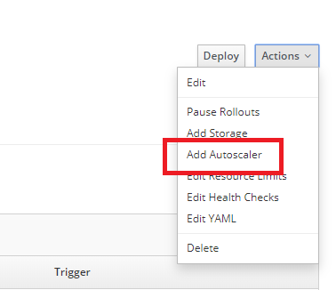

# Lab - DevOps Workshop on OpenShift 

## Overview

>The DevOps with OpenShift Workshop provides full-stack and DevOps engineers an introduction to OpenShift and containers and how it can be used to build fully automated end-to-end deployment pipelines using basic deployments techniques like rolling deploys.

>This workshop is a first event with a series of hands-on labs that are designed to familiarize participants with DevOps, Continuous Delivery concepts for Gerdau Reference Architecture approach. The workshop will walk them through provide and building an automated applications using concepts of Gerdau reference Architecture.


The lab application used in this workshop is available at https://gitlab.gerdau.digital/devops-public/ocp-lab-guide.git

### Agenda
* DevOps Introduction
* Explore OpenShift Features
* Deployment a Simple Template Stack
* Using a Simple Gitlab CI/CD Pipeline
* Automated Zero-Downtime Deployment with CI/CD Pipelines


| | |
--- | ---
| Audience Experience Level | Beginner |
| Supported Number of Users | Up to 30 |
| Average Time to Complete | 2 hours |

## Provisioning Concepts

### Demonstration - Deploying Gitlab Server and Runner

Estimated time: 10 minutes

In this first part we will demonstrate the concept of how to provision a template-based stack, in which we will apply Gitlab Server CE and a runner.

* We will create a project with the name `gitlab` (or any other name, that's just a suggestion) where the workshop Gitlab components will be deployed.
* We will import the templates provided by the product owner supplier. An [Gitlab-ce](https://gitlab.com/gitlab-org/omnibus-gitlab/blob/0605d31e8d2777d258bbc06f9bc5270574a0249d/docker/openshift-template.json) and [Gitlab-runner](https://gitlab.com/gitlab-org/omnibus-gitlab/blob/f04b5c4443b3a98011577cdd7c9de766a287531e/docker/openshift/runner-template.yml
) will be used for that Lab.
* In the OpenShift service catalog "Gitlab-ce" and "gitlab-runner" will be avalible for deployment.

```sh

oc new-project gitlab
oc adm policy add-scc-to-user anyuid -z gitlab-ce-user -n gitlab
oc adm policy add-scc-to-user privileged -z gitlab-runner-user -n gitlab
oc create -f gitlab-ce.yaml
oc create -f runner.yaml


```

## Gerdau's Reference Architecture Highlights:

* Stacks can be provided and destroyed with minimal effort.
* Templates can be migrated for any Cloud provider.
* Templates could be provided and supported for some partner/product owner.

## Let's Get Start! 

### 1. Gitlab - Register User and Create New Projects 

Estimated time: 10 minutes

* Register a new one user for use a Gitlab CE in Lab environment, use a URL address provided from Workshop.
* Create two new **Public** and **empty** projects with the name `backend` and `frontend` (or any other name, that's just a suggestion) where the codes projects will be deployed.
* Send an initial commit for provided codes.

```sh

git clone https://gitlab.gerdau.digital/devops-public/ocp-lab-guide.git
cd ocp-lab-guide/apps/backend
git init
git remote add backend <your-gitlab-project-url>
git add .
git commit -m "Initial commit"
git push -u backend master


```

```sh

git clone https://gitlab.gerdau.digital/devops-public/ocp-lab-guide.git
cd ocp-lab-guide/apps/frontend
git init
git remote add frontend <your-gitlab-project-url>
git add .
git commit -m "Initial commit"
git push -u frontend master


```

### 2. Stack Overview

Estimated time: 5 minutes

The Lab stack is a microservices architecture which is a simulation of frontend application that can send a json data to a backend app simulating a data persistence.

* **Frontend**: A Python based frontend
* **Backend**: NodeJs based service exposing REST API Models

```
                              +-------------+
                              |             |
                              |   Frontend  |
                              |     Web     |
                              |             |
                              |    Python   |
                              |             |
                              +------+------+
                                     |
                                     v
                              +------+------+
                              |             |
                              |   Backend   |
                              |   Swagger   |
                              |             |
                              |   Node.js   |
                              +------+------+


```

Take a quick look in code of both applications.

## Gerdau's Reference Architecture Highlights:

* Take advantage of emerging technologies for any microservice component.

### 3. Deploying Stacks

Estimated time: 20 minutes

TIPS: In this step we are going to use Openshift Web UI and Openshift client command line as well.


* Openshift client is avaliable in `support\` folder.
* Create a project with your own name (or any other name, that's just a suggestion) where the workshop stack will be deployed.

```

oc login <ocp-address> --username=<your-user> --password=<your-password>
oc new-project <your-name>


```

* **Openshift Client** Import the templates provided by the Devops Team. An [backend](https://gitlab.gerdau.digital/devops-public/ocp-lab-guide/blob/master/stacks/backend-template.yaml) and [frontend](https://gitlab.gerdau.digital/devops-public/ocp-lab-guide/blob/master/stacks/frontend-template.yaml
) will be used for that Lab.


```

oc login <ocp-address> --username=<your-user> --password=<your-password>
oc create -f ocp-lab-guide/stacks/backend-template.yaml
oc create -f ocp-lab-guide/stacks/frontend-template.yaml


```

* **Openshift Web UI** In the OpenShift service catalog search for "Backend Gerdau Lab" and then click on the **Next** button.


* Enter the requested info. Your Gitlab project code created in previous steps are required. 

* **Openshift Web UI** In the OpenShift service catalog search for "Frontend Gerdau Lab" and then click on the **Next** button.


* Enter the requested info. Your Gitlab project code created in previous steps are required. 


* After wizard for deployment is done, take a look at output of command line bellow, which describe objects created inside Openshift project:

```

oc login <ocp-address> --username=<your-user> --password=<your-password>
oc get all --selector application=backend
oc get all --selector application=frontend


```

* **Openshift Web UI** In the OpenShift tab Overview >> expand deploymentconfig search for URL address of applications.
* From browser access both applications to make sure that is up running:

`<your-frontend-address/>` and `<your-frontend-address/healthz>`

It is a expected return from web browser:

```json

{
  "backend_status": "ok", 
  "frontend_status": "ok"
}


```

`<your-backend-address/>` and `<your-backend-address/api-docs.json>`

It is a expected return from web browser:

```json

{"info":{"description":"Cloud/Devops Gerdau","title":"API Cloud/Devops Gerdau","version":"1.0.0"},"host":"<your-backend-address>","basePath":"/v1","produces":["application/json","application/json"],"schemes":["https"],"swagger":"2.0","paths":{},"definitions":{"Request":{"required":[],"properties":{"chars":{"type":"string","description":"Retorna nome informado."}}}},"responses":{},"parameters":{},"securityDefinitions":{},"tags":[]}


```

### 4. Running the Backend Api Pipeline

Estimated time: 20 minutes

* Copy a pipeline file provided by Devops Team from folder `pipelines\.gitlab-ci.yml` to folder `apps\backend` folder.
* Edit file `.gitlab-ci.yml` and replace the information located in the keys `<ocp-address>`, `<your-user>`, `<your-password>` and `<your-project-name>` in pipeline file.
* Edit a piece of backend code described below in module file `apps\backend\api-backend-router.js`.

```js

router.post('/request', async (req, res) => {

    try {
        
        logger.debug(req.body);
        console.log("new version is applied"); //insert this new line
        let obj = req.body
        return res.status(200).json(obj);

    } catch (e) {

        console.error(e);

        return res.status(500).json(e);

    }

});


```

* Submit a commit for new change.

```sh

git add .
git commit -m "new version for backend"
git push -u backend master


```

* Take a look in Gitlab UI pipeline log status, Tab CI/CD >> Pipelines


* When build step is done, take a look in Openshift UI Tab Overview >> backend >> deploymentconfig >> containers, that should exchange containers versions.


### 5. Kibana Log Tracing

Estimated time: 10 minutes

* Open frontend app URL address in web browser. 
* Let's simulate a purposeful error, filling the form at frontend app sending a `no numeric character` input in the `User ID` field (suggestion type "teste"), where this field expects a value of int type.
* Navigate on URL [Kibana](https://kibana.apps.saopaulo-9b96.open.redhat.com/) provided in Workshop. 
* Insert a query bellow in Kibana discovery tab, `projects*` filter.


```

kubernetes.pod_name:frontend* AND kubernetes.namespace_name:<your-namespace> AND message:ERROR* 


```

* For change done in previous backend commit, insert a query bellow in Kibana discovery tab, `projects*` filter.


```

kubernetes.pod_name:backend* AND kubernetes.namespace_name:<your-namespace> AND message:new version is applied


```

* Analyze the results and try to think in real Gerdau application, where these queries can fit.


## Gerdau's Reference Architecture Highlights:

* Logging index patterns.


### 6. Demonstration - Understanding How Zero-Downtime Works

Estimated time: 15 minutes

* Start a new one deployment in Openshift UI tab Applications >> deployments >> backend >> deploy button
* From Linux based bash type command line bellow:

```
while :; do curl -I <backend-url/api-docs/> | grep -i "HTTP/1.1 200 OK"; done

```

* Expected results is always to have a response from app:

```sh

"HTTP/1.1 200 OK"


```

Take a quick look in backend code module file `api-health.js`.

## Gerdau's Reference Architecture Highlights:

* Release new version from applications any time.
* Minimize downtime


### 7.Bonus: Autoscaling Frontend Application 

Estimated time: 20 minutes

* In the OpenShift Web UI navigate in tab Applications >> deployments >> frontend >> actions >> Add Autoscaler




* In the OpenShift navigate in Applications >> deployments >> frontend >> actions >> Edit Resource Limits


* Using [Apache JMeter](http://jmeter.apache.org/download_jmeter.cgi) take a template stress test provided by Devops Team [frontend-stress-test](https://gitlab.gerdau.digital/devops-public/ocp-lab-guide/blob/master/bonus/frontend-stress-test.jmx).


* Edit `frontend-stress-test.jmx` file providing your frontend URL address and start a Jmeter test.


* In the OpenShift take a look at Overview >> application frontend >> Pods
* New Pods should be scaled up


### 8.Bonus: Deploying a Blue/Green Backend Stack

Estimated time: 25 minutes

Explanation: 

>1. In this scenario, we are going to build two different versions for blue/green backend swagger.
>2. Note that will be created two diferent external URLs and Openshift services objects for Blue and Green versions.
>3. Routing is initially driving 100% of traffic to the Green version.
>4. Let's simulate a change of traffic, where connections will be drained to Blue version.


* Delete a previous backend stack in order to provide a new one bluegreen-based.

```sh

oc login <ocp-address> --username=<your-user> --password=<your-password>
oc project <your-name>
oc delete all --selector application=backend


```

* Create a new one git branch for backend code called feature-blue.

```sh

git clone "<your-backend-project>"
git checkout -b feature-blue master


```

* Edit a piece of backend code described below in module file `backend\apps.js`.

```js

let options = {
    swaggerDefinition: {
        info: {
            description: 'Cloud/Devops Gerdau',
            title: 'Blue version', //insert this new line
            version: '1.0.0',
        },
        host: `${host}`,
        basePath: '/v1',
        produces: [
            "application/json",
            "application/json"
        ],
        schemes: [_schemas]
    },
    basedir: __dirname, //app absolute path
    files: ['./*route*.js'] //Path to the API handle folder
};


```

* Submit a commit for **feature-blue branch**.

```sh

git commit -am "feature-blue"
git push -u backend feature-blue


```

* Import the templates provided by the Devops Team. An [backend-bluegreen](https://gitlab.gerdau.digital/devops-public/ocp-lab-guide/blob/master/bonus/backend-bluegreen-template.yaml) will be used for that Lab.


```sh

oc login <ocp-address> --username=<your-user> --password=<your-password>
oc project <your-name>
oc create -f ocp-lab-guide/bonus/backend-bluegreen-template.yaml

```


* In the OpenShift Web UI service catalog search for "Backend Gerdau Bluegreen Lab" and then click on the **Next** button.
* Enter the requested info. Your Gitlab project code created in previous steps are required. 


* After wizard for deployment is done, take a look at output of command line bellow, which describe objects created inside Openshift project:

```sh

oc login <ocp-address> --username=<your-user> --password=<your-password>
oc get all --selector application=backend


```

* From browser access beckend applications to make sure that is up running:
`<your-backend-address/api-docs.json>`

It is a expected return from web browser

```json

{"info":{"description":"Cloud/Devops Gerdau","title":"API Cloud/Devops Gerdau","version":"1.0.0"},"host":"<your-backend-address>","basePath":"/v1","produces":["application/json","application/json"],"schemes":["https"],"swagger":"2.0","paths":{},"definitions":{"Request":{"required":[],"properties":{"chars":{"type":"string","description":"Retorna nome informado."}}}},"responses":{},"parameters":{},"securityDefinitions":{},"tags":[]}
 
```

* Let's drain connections to be handled in backend-blue version:

```sh

oc set route-backends backend --adjust backend-blue=100%

```
* In the OpenShift Web UI tab Applications >> routes >> backend, note that traffic has been drained to backend-blue version:


* From anonymous browser session (in order to avoid any cache) check if blue version is up running:

`<your-backend-address/api-docs.json>`

It is a expected return from anonymous web browser session:

```json

{"info":{"description":"Cloud/Devops Gerdau","title":"Blue Version","version":"1.0.0"},"host":"<your-backend-address>","basePath":"/v1","produces":["application/json","application/json"],"schemes":["https"],"swagger":"2.0","paths":{},"definitions":{"Request":{"required":[],"properties":{"chars":{"type":"string","description":"Retorna nome informado."}}}},"responses":{},"parameters":{},"securityDefinitions":{},"tags":[]}
 
```


## Gerdau's Reference Architecture Highlights:

* Minimize downtime
* Take advantage of plataforms features.


# For now that is all! I hope you guys enjoyed and had fun!